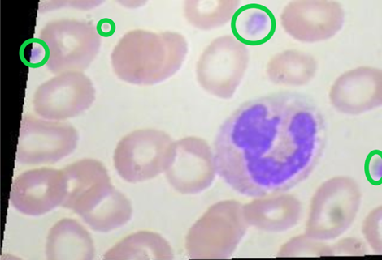
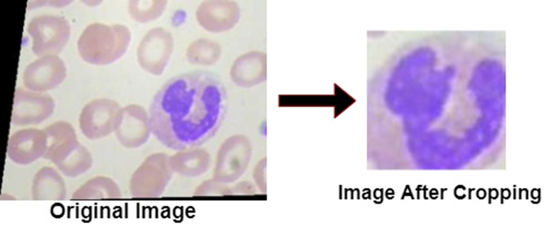
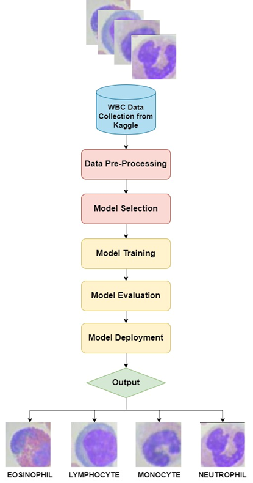

# White Blood Cell Classification 

Live Hosted Web Link: [🚀 Visit Live Website](https://wbc.onrender.com/) 
Video Demo: [📺 Watch the Video Demo](https://www.youtube.com/watch?v=1NqH9XWJdNA)

This repository contains code and resources for a 4-class classification task of white blood cells. The objective is to classify white blood cell images into four different classes based on their morphology.

## Dataset
The dataset used for this classification task consists of images of white blood cells, with each image belonging to one of the following four classes:

1. Neutrophils
2. Lymphocytes
3. Monocytes
4. Eosinophils

Each image from the dataset includes a WBC cell that is highlighted in blue, as well as a little amount of blue-colored noise, as shown in the figure 4. We employed a method known as outlier technique to lessen this noise. A data point in a dataset that is significantly far away from the other values in the same dataset is referred to as an outlier. Outliers might be the consequence of measurement errors, data entry mistakes, or real observations that are just infrequent or unexpected. Outliers can have a substantial impact on a dataset's analysis and lead to inaccurate conclusions if they are not handled properly. Now these far away blue colored noise has to be reduced in the dataset. So here we basically get the pixels of the whole image in both x and y axes, and collects all blue color pixels. Now outliers’ technique will take the coordinates of both x and y axes values and checks the closely packed pixels and far away pixels, then it removes the pixels which are far away from the closely packed ones.

After eliminating the noise in the data, we cropped the image so that only the blue-highlighted portion was transferred to the data, potentially improving accuracy. By determining the intersection locations of the lines created by the maximum and minimum values of the x-axis and y-axis of pixels of the highlighted blue region, this cropping is performed. To make the generated final image easier to read, we extended the lines' pixel length. The final image is shown in figure 5 below

 Work Flow

1.	Data gathering: Gathering a sizable number of digital photographs of white blood cells from diverse platforms, such flow cytometry or microscopy.
2.	 Data preparation: Enhancing the characteristics for better classification by preprocessing the pictures to eliminate any noise, normalize the color and contrast, and remove any artefacts.
3.	Feature extraction: To identify different types of white blood cells and their properties, features are extracted from the pictures using deep learning techniques like convolutional neural networks (CNNs).
4.	Model training: Improving the classification accuracy of white blood cells by teaching a machine learning or deep learning model, such as a CNN, the retrieved characteristics.
5.	Model evaluation involves assessing the trained model's performance on a different test dataset and refining the model's parameters for increased precision and productivity.

